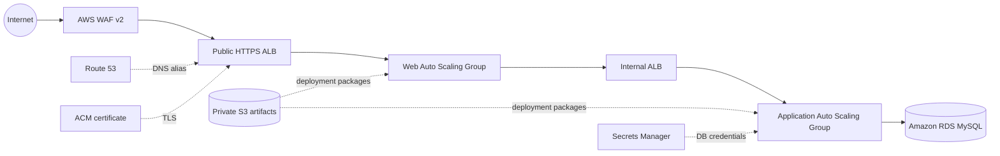

# AWS Secure 3-Tier Architecture with Terraform

A portfolio-ready AWS reference implementation that provisions an internet-facing web application across isolated web, application, and database tiers. Terraform creates the network, load balancers, EC2 Auto Scaling Groups, managed database, TLS certificate, DNS, WAF controls, deployment bucket, IAM access, and database secret.

> **Cost notice:** This stack creates billable resources, including two NAT Gateways, two Application Load Balancers, EC2 instances, WAF, Route 53, and an RDS Multi-AZ database. Review the plan and current AWS pricing before deployment.

## Architecture



### Networking

The VPC spans the first two available Availability Zones in the selected region. Each AZ contains a public subnet plus private web, app, and database subnets. The public ALB and one NAT Gateway per AZ use the public subnets. EC2 instances receive no public IPs; database subnets have no internet route.

## Design Highlights

### Security

- Security groups enforce the request path: public ALB → web port, web tier → internal ALB, internal ALB → app port, and app tier → MySQL on `3306`.
- The artifact bucket blocks public access, enables versioning, and uses server-side encryption. Database credentials are generated and stored in Secrets Manager.
- EC2 requires IMDSv2 and is managed through Systems Manager instead of inbound SSH.

Web and app instances currently retain broad outbound access because bootstrap installs packages and calls AWS services through NAT. Both tiers also share one IAM role, so the web tier can read the database secret even though it does not require it. See [Future Improvements](#future-improvements).

### ACM and HTTPS

The public ALB accepts HTTP and HTTPS. Port `80` redirects to `443`, where a DNS-validated ACM certificate and `ELBSecurityPolicy-TLS13-1-2-2021-06` terminate TLS. Route 53 creates the public alias record and certificate-validation records.

### AWS WAF

WAF is enabled by default and associated with the public ALB. IP reputation, SQL injection, and per-IP rate-limit rules block requests. Common Rule Set and Known Bad Inputs run in count mode for observation, so they do not currently block matches.

### High Availability and Auto Scaling

Both ALBs and both EC2 Auto Scaling Groups span two Availability Zones. Default web and app capacity is two instances per tier, with an allowed range of two to four. ELB health checks replace unhealthy instances, and launch-template changes use rolling instance refreshes. The ASGs do **not** yet include target-tracking or step-scaling policies. RDS Multi-AZ is enabled by default; this is a standby deployment, not an Aurora cluster or read-replica topology.

### Amazon RDS

The database tier is a private, encrypted RDS MySQL instance with storage autoscaling, seven-day backup retention, a final-snapshot requirement, and deletion protection. Multi-AZ is configurable and enabled by default. Only the app security group can initiate MySQL connections.

### IAM and Application Delivery

The EC2 role has Systems Manager access, read-only access to the project artifact bucket, and read access to one database secret. Startup templates download ZIP artifacts from S3, build the React frontend behind Nginx, retrieve database credentials, and run the Express service with PM2. The service creates its `transactions` table idempotently at startup. Terraform provisions the bucket but does not upload artifacts.

## Repository Structure

| Path | Purpose |
| --- | --- |
| `aws-3tier-terraform/` | AWS resources, variables, outputs, and EC2 bootstrap templates |
| `web-tier/` | React frontend and React Testing Library test setup |
| `app-tier/` | Express/MySQL transaction demo API |
| `.github/workflows/terraform-validate.yml` | Formatting, initialization, and validation checks |

Terraform is organized by concern: `networking.tf`, `security-groups.tf`, `alb.tf`, `internal-alb.tf`, `autoscaling.tf`, `launch-templates.tf`, `rds.tf`, `iam.tf`, `s3.tf`, `secrets.tf`, `acm.tf`, `route53.tf`, and `waf.tf`.

## Prerequisites

- Terraform `>= 1.6`
- AWS CLI and credentials authorized to create the documented services
- Node.js/npm for local application builds
- A registered domain and access to update its authoritative name servers
- An AWS account with sufficient service quotas in the target region

## Deployment

### 1. Configure and validate

```powershell
Copy-Item aws-3tier-terraform/terraform.tfvars.example aws-3tier-terraform/terraform.tfvars
aws sts get-caller-identity
terraform -chdir=aws-3tier-terraform init
terraform -chdir=aws-3tier-terraform fmt -check
terraform -chdir=aws-3tier-terraform validate
```

Edit `terraform.tfvars` with a domain you control. The file is intentionally ignored.

### 2. Bootstrap DNS and artifact storage

The hosted zone and S3 bucket must exist before registrar delegation and artifact upload. Create a reviewed bootstrap plan:

```powershell
terraform -chdir=aws-3tier-terraform plan -var-file=terraform.tfvars -target=aws_route53_zone.main -target=aws_s3_bucket.artifacts -target=aws_s3_bucket_public_access_block.artifacts -target=aws_s3_bucket_versioning.artifacts -target=aws_s3_bucket_server_side_encryption_configuration.artifacts -out=bootstrap.tfplan
terraform -chdir=aws-3tier-terraform apply bootstrap.tfplan
terraform -chdir=aws-3tier-terraform output route53_name_servers
```

Delegate the domain to those Route 53 name servers. DNS propagation is required before ACM validation can complete.

### 3. Package and upload the applications

Run from the repository root. Generated ZIPs are ignored by Git.

```powershell
Compress-Archive -Path app-tier -DestinationPath app-tier.zip -Force
Compress-Archive -Path web-tier -DestinationPath web-tier.zip -Force
$bucket = terraform -chdir=aws-3tier-terraform output -raw artifacts_bucket_name
aws s3 cp app-tier.zip "s3://$bucket/app-tier/app-tier.zip"
aws s3 cp web-tier.zip "s3://$bucket/web-tier/web-tier.zip"
```

### 4. Plan and deploy

```powershell
terraform -chdir=aws-3tier-terraform plan -var-file=terraform.tfvars -out=tfplan
terraform -chdir=aws-3tier-terraform apply tfplan
terraform -chdir=aws-3tier-terraform output application_url
```

Review every plan. This repository does not run `terraform apply` in CI.

## Destroy Procedure

Destruction is intentionally guarded. Back up required data, set `rds_deletion_protection = false`, then plan and apply that update first. Empty every S3 object version and deletion marker, confirm the final RDS snapshot identifier is available, and review a separate destroy plan:

```powershell
terraform -chdir=aws-3tier-terraform plan -var-file=terraform.tfvars -out=disable-protection.tfplan
terraform -chdir=aws-3tier-terraform apply disable-protection.tfplan
terraform -chdir=aws-3tier-terraform plan -destroy -var-file=terraform.tfvars -out=destroy.tfplan
terraform -chdir=aws-3tier-terraform apply destroy.tfplan
```

Never destroy a production environment without explicit approval.

## Security Considerations

Terraform state contains the generated RDS password; use an encrypted remote backend with tightly controlled access for shared environments. The bootstrap writes credentials to `DbConfig.js` with owner-only permissions, so instance access remains sensitive. SQL queries are parameterized and direct cross-origin browser access is disabled by default, but the demo API still requires authentication, authorization for destructive operations, and automated tests before production use.

## Future Improvements

- Split web and app IAM roles so only the app tier can read the database secret.
- Add S3, Systems Manager, and Secrets Manager VPC endpoints, then restrict compute-tier egress.
- Add ASG target-tracking policies, CloudWatch alarms, ALB/WAF access logs, and RDS log exports.
- Configure an encrypted remote Terraform backend with state locking and separate environment state.
- Pin immutable AMI/application versions and add artifact checksums or a build pipeline.
- Add `tflint`, Checkov, dependency scanning, backend tests, and end-to-end health checks to CI.
